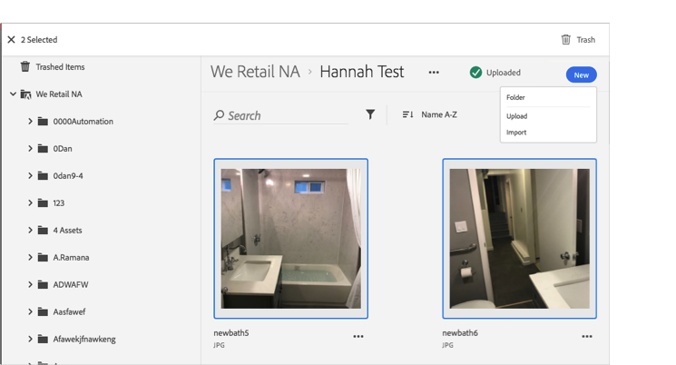

# Enviar um ativo para a lixeira{#trash-an-asset}

É possível enviar um ativo para a lixeira na Biblioteca da Adobe Experience Cloud para removê-lo da Biblioteca.

Para enviar um ativo para a lixeira na Biblioteca da Experience Cloud:

1. Clique em um ou mais ativos para enviar para a lixeira. 

1. Clique no ícone **[!UICONTROL Lixeira]** na parte superior da página.

