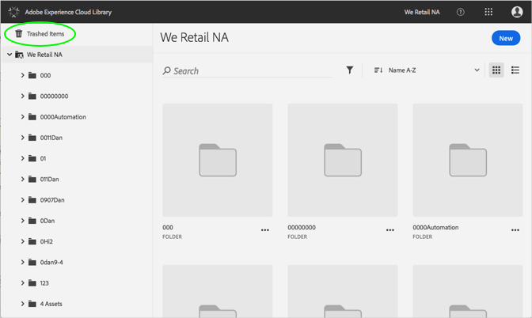
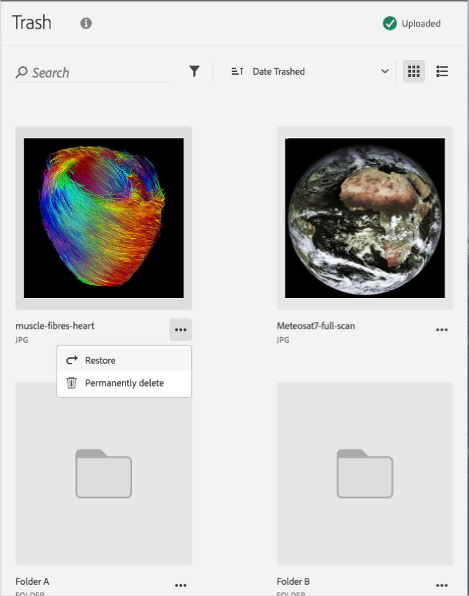

# Excluir permanentemente um ativo com tendência{#permanently-delete-a-trashed-asset}

Você pode excluir permanentemente um ativo com tendência na Biblioteca da Adobe Experience Cloud.

Quando você lixeira um item, ele fica na área Itens com tendência na Biblioteca da Experience Cloud por 60 dias. Se você não restaurar itens, a Biblioteca da Experience Cloud excluirá permanentemente os itens após 60 dias.

É possível excluir permanentemente um ativo com detecção de tendência antes de 60 dias:

1. Clique **[!UICONTROL em Itens com tendência]**.

   

1. Clique em um ou mais itens para excluir permanentemente.
1. Clique em **[!UICONTROL Mais informações &gt; Excluir permanentemente]**.

   

1. Confirme se deseja excluir permanentemente os ativos selecionados.

