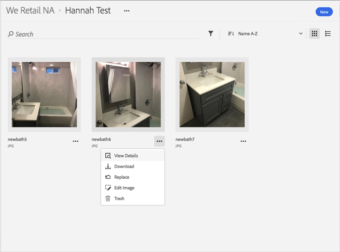
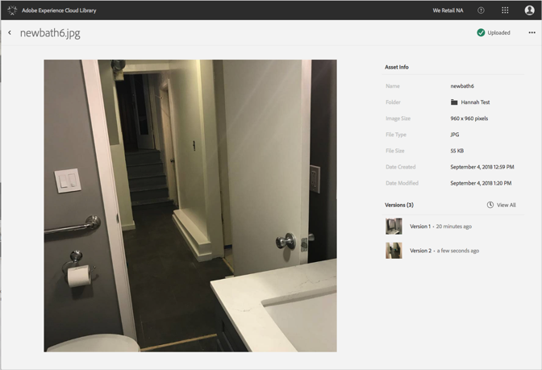

# Reverter para uma versão anterior de um ativo{#revert-to-an-older-version-of-an-asset}

Você pode reverter para uma versão mais antiga de um ativo na Biblioteca da Adobe Experience Cloud.

Para reverter para uma versão mais antiga de um ativo na Biblioteca da Experience Cloud:

1. Clique em um ativo.
1. Clique no menu **[!UICONTROL Mais opções]** (reticências) ao lado do ativo.

   

1. Clique em **[!UICONTROL Detalhes do ativo]**.
1. Clique em **[!UICONTROL Exibir todos]** ao lado de Versões para ver todas as versões do ativo.

   

1. Na lista de versões, clique no menu **[!UICONTROL Mais opções]** (reticências) ao lado da versão para a qual você deseja reverter.

   

1. Clique em **[!UICONTROL Reverter]**.

A versão para a qual você reverteu agora torna-se a versão atual.
