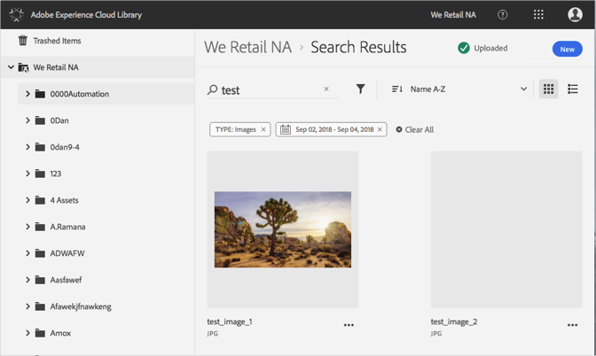

# Pesquisar por ativos{#search-for-assets}

Pesquise ativos na Biblioteca da Adobe Experience Cloud para localizar ativos na organização ou em uma pasta específica.

Pesquise ativos na Biblioteca da Experience Cloud usando a barra de pesquisa. A pesquisa procura pelos nomes de arquivo.

