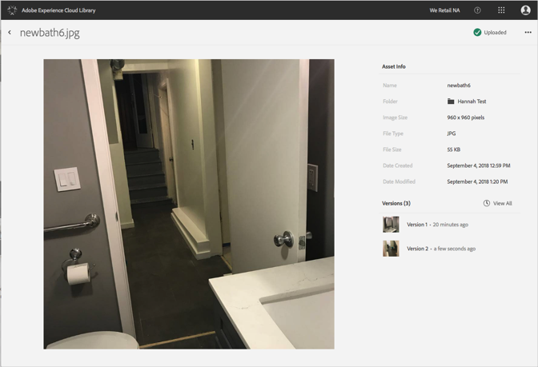

# Exibir informações detalhadas de um ativo{#view-detailed-information-for-an-asset}

Exibir informações detalhadas sobre ativos, incluindo versões, na Biblioteca da Adobe Experience Cloud.

Para exibir informações detalhadas sobre os ativos, incluindo versões, na Biblioteca da Experience Cloud:

1. Clique em um ativo.
1. Clique no menu **[!UICONTROL Mais opções]** (reticências) ao lado do ativo.

   

1. Clique **[!UICONTROL em Exibir detalhes]** para visualizar mais detalhes de um ativo.

   

