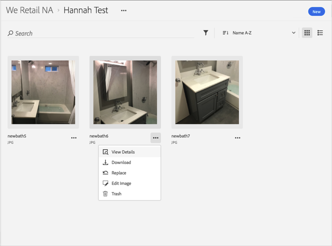

# Exibir versões anteriores de um ativo{#view-previous-versions-of-an-asset}

É possível exibir versões anteriores de um ativo na Biblioteca da Adobe Experience Cloud.

Para exibir versões anteriores de um ativo na Biblioteca da Experience Cloud:

1. Selecione um ativo.
1. Selecione o menu **[!UICONTROL Mais opções]** (reticências) ao lado do ativo.

   

1. Selecione **[!UICONTROL Detalhes do ativo]**.
1. Selecione **[!UICONTROL Exibir todos]** ao lado de Versões para ver todas as versões do ativo.

   

