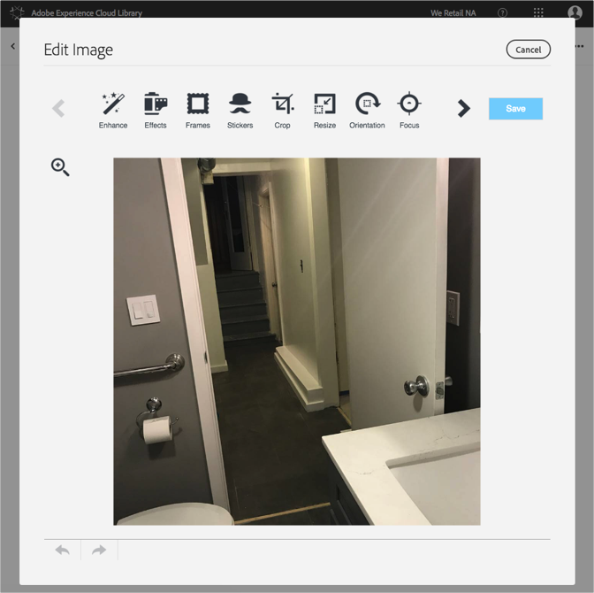

# Editar uma imagem{#edit-an-image}

Use o editor de imagens básico incorporado à Biblioteca da Adobe Experience Cloud para editar uma imagem de forma dinâmica diretamente da biblioteca.

Para editar uma imagem da Biblioteca da Experience Cloud:

1. Clique em uma imagem para editar.
1. Clique em Editar imagem. Quando você salva a imagem, ela é salva como uma nova versão.

   O editor de imagens é aberto e você pode editar a imagem.

   

