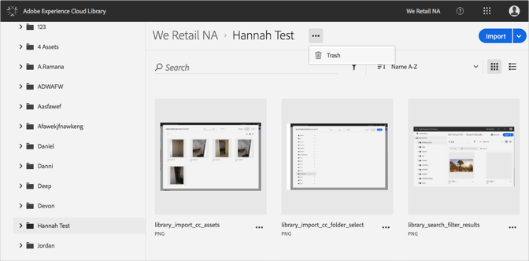
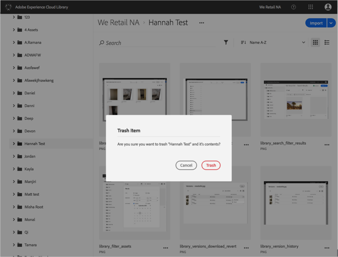

# Enviar uma pasta para a lixeira{#trash-a-folder}

É possível enviar uma pasta para a lixeira na Biblioteca da Adobe Experience Cloud.

Para enviar uma pasta para a lixeira na Biblioteca da Experience Cloud:

1. Clique na pasta para que deseja enviar para a lixeira.
1. Clique no menu **[!UICONTROL Mais opções]** (reticências) e selecione **[!UICONTROL Lixeira]**.

   

1. Confirme se deseja enviar a pasta para a lixeira.

   

