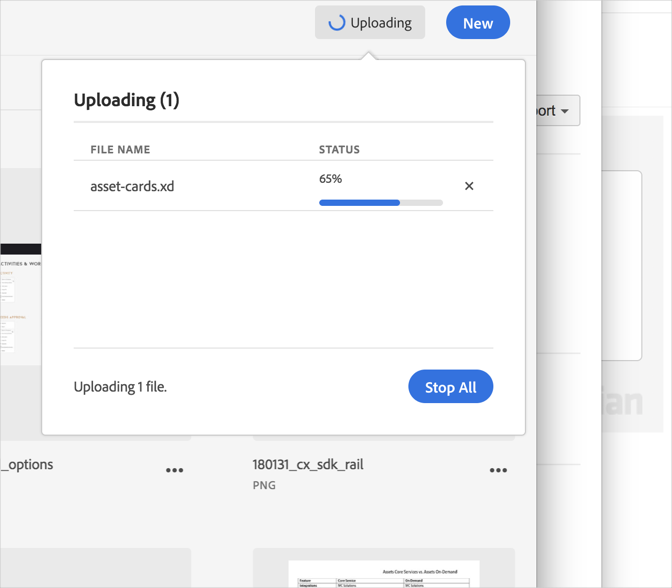

# Cancelar um upload{#cancel-an-upload}

Cancele um upload do seu dispositivo para a Biblioteca da Adobe Experience Cloud se você selecionou um arquivo incorreto ou muito grande.

Para cancelar um upload já iniciado:

1. Clique no indicador de notificação.
1. Clique em **[!UICONTROL Parar tudo]** para interromper todos os downloads ou clique no **[!UICONTROL X]** ao lado de arquivos individuais para cancelar.

   

Se você selecionar um ou mais arquivos com o mesmo nome, a Biblioteca da Experience Cloud solicitará que você substitua as versões antigas ou mantenha as novas.
