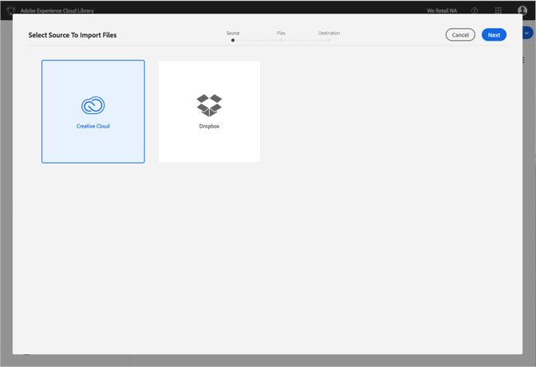
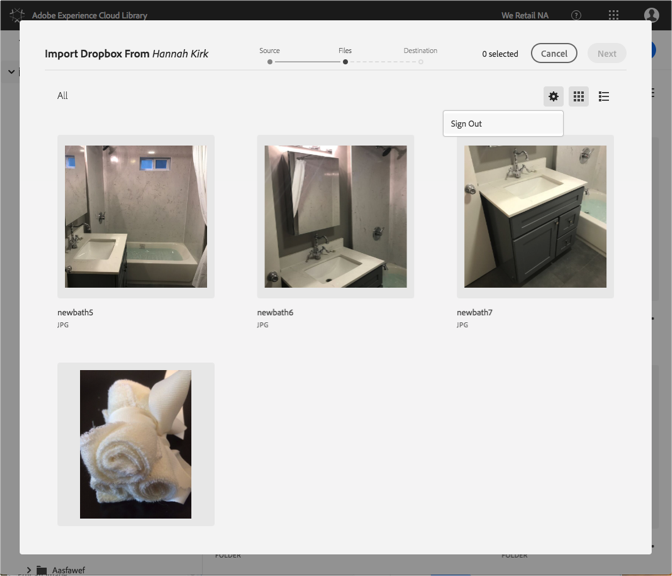

# Alterar contas do Dropbox ou da Creative Cloud{#change-dropbox-or-creative-cloud-accounts}

Alterne para uma conta diferente do Dropbox ou da Creative Cloud para adicionar conteúdo à Biblioteca da Adobe Experience Cloud.

Depois de fazer logon em uma conta do Dropbox ou da Creative Cloud, você continuará conectado a menos que você faça logoff ou alterne as contas.

Para alternar para uma conta diferente do Dropbox ou da Creative Cloud:

1. Selecionar **[!UICONTROL Novo]** > **[!UICONTROL Importar]**.

   

1. Selecione **[!UICONTROL Creative Cloud]** ou **[!UICONTROL Dropbox]**.

   

1. Selecione **[!UICONTROL Próximo]**.
1. Selecione o ícone de engrenagem no canto superior direito.

   

1. Selecione **[!UICONTROL Sair]**.
1. Faça logon na outra conta.

