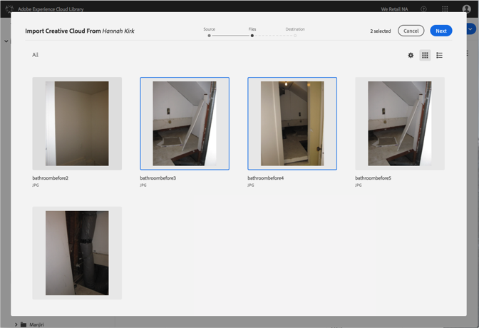
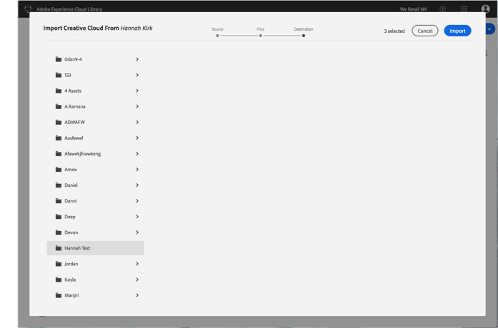

# Importar arquivos da Creative Cloud para a Biblioteca da Adobe Experience Cloud{#import-creative-cloud-files-into-the-adobe-experience-cloud-library}

Importe arquivos da Creative Cloud para a Biblioteca da Adobe Experience Cloud para gerenciá-los a partir de qualquer produto da Adobe Experience Cloud.

>[!NOTE]
>
>Você deve criar uma pasta antes de executar essa tarefa.

Para importar arquivos da Creative Cloud para a Biblioteca da Experience Cloud:

1. Selecione **[!UICONTROL Novo]** &gt; **[!UICONTROL Importar]**.

   

1. Selecione **[!UICONTROL Creative Cloud]**.

   Faça logon na sua conta da Creative Cloud, caso ainda não o tenha feito.

   

1. Clique em **[!UICONTROL Próximo]**.
1. Selecione um ou mais arquivos a serem importados.

   

1. Clique em **[!UICONTROL Próximo]**.
1. Selecione a pasta na qual colocar os ativos.

   >[!NOTE]
   >
   >Você pode escolher uma pasta para importar os ativos. Para colocar arquivos em pastas diferentes, repita essa tarefa para cada pasta.

   

1. Clique em **[!UICONTROL Importar]**.

