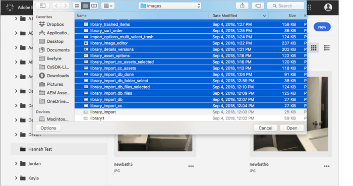
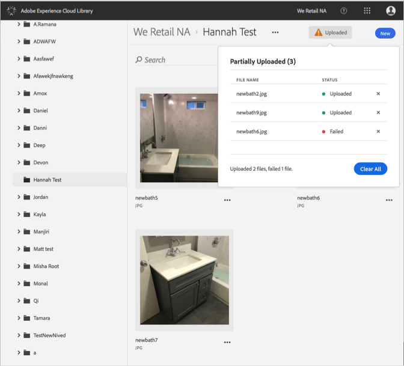

# Carregar ativo do dispositivo{#upload-asset-from-device}

Carregue ativos do dispositivo para gerenciá-los na Biblioteca da Adobe Experience Cloud.

Para carregar ativos de seu dispositivo para a Biblioteca da Experience Cloud:

1. Selecione **[!UICONTROL Novo]** &gt; **[!UICONTROL Carregar]**.

   

1. Selecione os ativos para carregar na Biblioteca da Experience Cloud.

   

1. Quando os arquivos tiverem o carregamento ativado, uma confirmação ou qualquer mensagem de erro será exibida na caixa de notificação.

   

